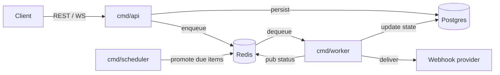

# Notification System

Event-driven notification service built in **Go** / **Clean Architecture**.  
Accepts requests over REST, processes them asynchronously through Redis-backed priority queues, and delivers to an external provider across **SMS / Email / Push** channels.

**Features:** priority queues · per-channel rate limiting · idempotency · retry + DLQ · scheduled delivery · message templates · WebSocket status streaming · Prometheus / Grafana / Jaeger

---

## Architecture

Three binaries share one `internal/` core. They communicate exclusively through **Postgres** (state) and **Redis** (queues / coordination).



**Status lifecycle**

```
pending → queued → sending → delivered
                           ↘ failed      (retries exhausted → DLQ)
          ↑
       cancelled  (only from pending / queued)
```

### Layers

| Layer | Package | Role |
|-------|---------|------|
| Domain | `internal/domain` | Entities, enums, validation, template rendering |
| Use cases | `internal/usecase` | Interactors + port interfaces |
| Adapters | `internal/adapter/*` | HTTP (Gin), Postgres repos, Redis queue/rate-limit/idempotency, webhook provider, WebSocket |
| Infrastructure | `internal/infrastructure/*` | Config, DB pool, Redis client, observability |
| Composition | `internal/app`, `cmd/*` | Wire and run |

---

## Quick start

```bash
cp .env.example .env   # set PROVIDER_URL (see below)
make up                # starts api · worker · scheduler · postgres · redis · prometheus · grafana · jaeger
```

| Service | URL |
|---------|-----|
| API | http://localhost:8080 |
| Swagger | http://localhost:8080/swagger/index.html |
| Prometheus | http://localhost:9090 |
| Grafana | http://localhost:3000 |
| Jaeger | http://localhost:16686 |

Scale workers: `docker compose -f deploy/docker-compose.yml up --scale worker=3`

### Provider setup (webhook.site)

1. Copy your unique URL from https://webhook.site.
2. Set `PROVIDER_URL=https://webhook.site/<uuid>` in `.env`.
3. Set the default response to **HTTP 202** with body:
   ```json
   {"messageId":"<uuid>","status":"accepted","timestamp":"2026-01-01T00:00:00Z"}
   ```

---

## API

### Notifications

```bash
# Create (single)
curl -X POST localhost:8080/api/v1/notifications \
  -H 'Content-Type: application/json' \
  -H 'Idempotency-Key: order-42' \
  -d '{"channel":"sms","recipient":"+905551234567","content":"Code: 1234","priority":"high"}'

# Create (batch, up to 1000)
curl -X POST localhost:8080/api/v1/notifications/batch \
  -H 'Content-Type: application/json' \
  -d '{"notifications":[
    {"channel":"sms","recipient":"+905551111","content":"A","priority":"normal"},
    {"channel":"email","recipient":"a@b.com","content":"B","priority":"low"}
  ]}'

# Schedule for the future
curl -X POST localhost:8080/api/v1/notifications \
  -H 'Content-Type: application/json' \
  -d '{"channel":"push","recipient":"device-1","content":"Reminder","scheduledAt":"2030-01-01T00:00:00Z"}'

# Get / list / cancel
curl localhost:8080/api/v1/notifications/<id>
curl "localhost:8080/api/v1/notifications?status=delivered&channel=sms&limit=20&offset=0"
curl -X DELETE localhost:8080/api/v1/notifications/<id>   # pending / queued only
curl localhost:8080/api/v1/batches/<batch-id>
```

### Templates

```bash
curl -X POST localhost:8080/api/v1/templates \
  -H 'Content-Type: application/json' \
  -d '{"name":"welcome","channel":"email","body":"Hello {{name}}!"}'

curl -X POST localhost:8080/api/v1/notifications \
  -H 'Content-Type: application/json' \
  -d '{"channel":"email","recipient":"a@b.com","templateId":"<id>","variables":{"name":"Ada"}}'
```

### WebSocket status stream

```bash
websocat "ws://localhost:8080/ws/notifications?id=<notification-id>"
```

---

## Design notes

| Concern | Approach |
|---------|----------|
| **Priority queue** | Three Redis lists drained high → normal → low via `BRPOP` |
| **Rate limiting** | Per-channel fixed-window counter in Redis (default 100 msg/s). Throttled items are re-queued, not dropped |
| **Idempotency** | `Idempotency-Key` header + Redis `SETNX` + Postgres `UNIQUE` constraint |
| **Retry + DLQ** | Fixed-interval retry via a Redis sorted set; after `MAX_RETRY_ATTEMPTS` the item is marked `failed` and moved to the DLQ |
| **Scheduling** | Future notifications held in a Redis sorted set; scheduler promotes due items to the queue every 300 ms |
| **Observability** | Prometheus metrics, `slog` JSON logs with `X-Correlation-ID`, OpenTelemetry traces → Jaeger, `/healthz` + `/readyz` |

---

## Development

```bash
make build            # compile api / worker / scheduler → bin/
make test             # unit tests (no Docker)
make test-integration # adapter tests (Docker via testcontainers)
make test-e2e         # full black-box e2e (Docker)
make lint             # golangci-lint
make fmt              # gofumpt + goimports
make swagger          # regenerate OpenAPI spec
```

### Testing strategy

- **Unit** — domain logic and every use case run against in-memory fakes; HTTP layer via `httptest`.
- **Integration** (`-tags=integration`) — Postgres and Redis adapters against ephemeral testcontainers.
- **E2E** (`-tags=e2e`) — real HTTP server, real workers/scheduler, real Postgres + Redis containers, mock webhook provider.

---

## Project layout

```
cmd/
  api/  worker/  scheduler/     composition roots
internal/
  domain/                       entities, enums, validation
  usecase/                      interactors + port interfaces
  adapter/
    http/  ws/                  REST handlers, WebSocket hub
    repository/postgres/        Postgres repos
    queue/redis/                priority queue, retry, DLQ, scheduled store
    ratelimit/redis/
    idempotency/redis/
    provider/webhook/
  infrastructure/               config, db, redis, observability
  app/                          shared wiring
migrations/                     versioned SQL (embedded)
deploy/                         docker-compose, Prometheus, Grafana
api/openapi/                    generated Swagger
```
